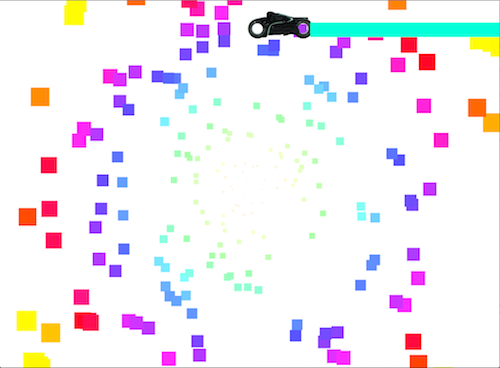

#animation Exercise

This exercise was done in order to more firmly grasp the concepts of images and classes and overall coding practices.

The code is a rework of the bubbles project in which the background is a modified version of that classes code.

Further more by pressing the 'D' key you can create a Tron Lightbike that will fly across the screen and create an animation across the screen.
